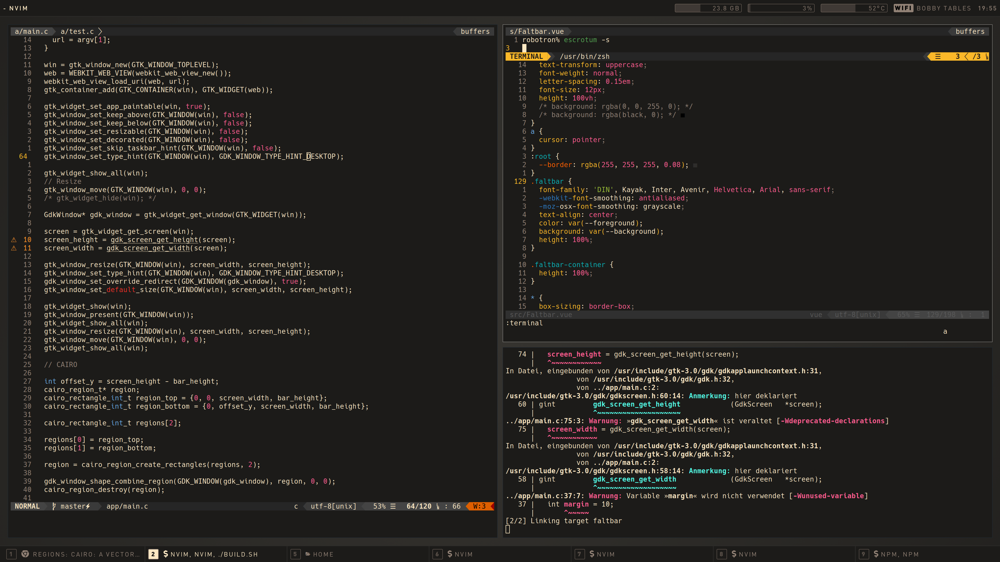

# Faltbar



Faltbar is a modular and highly customizable status bar for Linux.
The bar itself is a static HTML page, rendered in a WebKitGTK view. It connects
to a backend called Falter via WebSockets.

## Goals
The primary goal is to make Faltbar 100% customizable. Instead of inventing
abstractions, configurations or even new languages/protocols, Faltbar is using
only existing technologies, like HTML, JS and CSS.
The core is basically just a webview which renders a single HTML page.

## Rules

### No external requests
Faltbar does not and will never make requests to external resources. It
exclusively communicates to a backend running on localhost.
No external stylesheets or scripts are included.

### Modularity
Every component of Faltbar must be modular. A component should not interact
with other components, except for child components.

### Easy Customizing
Every component can be easily customized, extended or replaced.
The default theme is in no way making it hard or even impossible to overwrite
styling or layout.

## Project setup
```
npm install
```

### Compiles and hot-reloads for development
```
npm run serve
```

### Compiles and minifies for production
```
npm run build
```

### Lints and fixes files
```
npm run lint
```

### Customize configuration
See [Configuration Reference](https://cli.vuejs.org/config/).
